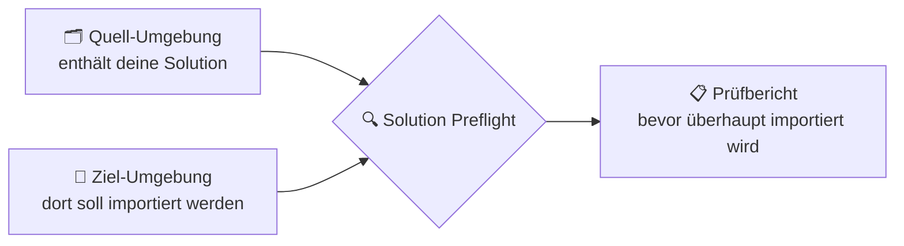
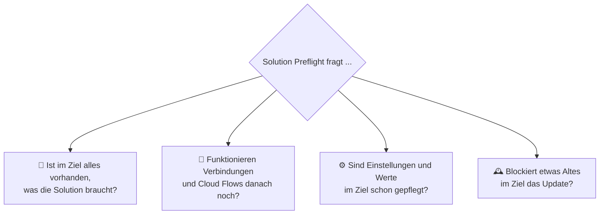
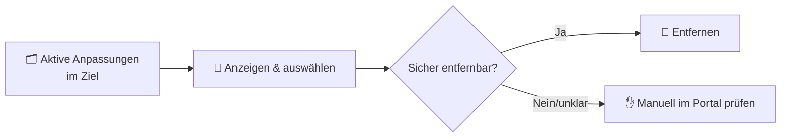

# Solution Preflight

Ein [XrmToolBox](https://www.xrmtoolbox.com/)-Tool von **Fabian Maas**, das dir vor jedem
Solution-Import verrät: *"Wird das gutgehen?"*

Wer schon einmal eine Dataverse/Dynamics-365-Solution in eine andere Umgebung importiert hat,
kennt das Problem: Der Import läuft "grün" durch – und trotzdem funktioniert danach ein Flow
nicht, ein Feld fehlt, oder eine Berechtigung greift nicht. **Solution Preflight** schaut sich
Quelle und Ziel *vorher* an und zeigt genau das, was sonst erst hinterher auffällt.

## Die Grundidee



Du wählst eine Solution in der Quell-Umgebung aus, verbindest das Tool zusätzlich mit der
Ziel-Umgebung, und startest die Analyse. Innerhalb weniger Sekunden bekommst du eine
verständliche Liste: Was ist okay, was sollte man sich anschauen, und was wird garantiert
Probleme machen.

## Was genau wird geprüft?

Die einzelnen Prüfungen lassen sich in vier einfache Fragen zusammenfassen:



| Frage | Was da im Hintergrund geprüft wird |
|---|---|
| 🧩 Vollständigkeit | Fehlende Tabellen, Felder und Steuerelemente (z. B. PCF-Komponenten), die die Solution benötigt, sowie ob das exportierte Solution-Paket selbst unbeschädigt ist |
| 🔗 Verbindungen & Automatisierung | Ob Cloud-Flow-Verbindungen im Ziel existieren – auch die, die ein Flow nur noch intern braucht, aber nicht mehr als Solution-Bestandteil gelistet ist – und ob Flows nach dem Import erst wieder manuell aktiviert werden müssen |
| ⚙️ Einstellungen & Werte | Ob Umgebungsvariablen im Ziel einen sinnvollen Wert haben, ob importierte Sicherheitsrollen überhaupt jemandem zugewiesen sind (oder mit einer bereits existierenden Rolle gleichen Namens kollidieren), und ob Formulare wegen fehlender Änderungen beim Import einfach übersprungen würden |
| 🕰️ Altlasten im Ziel | Ob der Solution-Herausgeber (Publisher) passt, ob sich der Solution-Typ (managed/unmanaged) ändern würde, ob die Solution-Version überhaupt höher ist als die bereits installierte, ob Quelle und Ziel auf unterschiedlichen Dataverse-Versionen laufen, ob alte, nicht verwaltete Anpassungen ("Layer") das Update verdecken könnten, und ob eine völlig fremde, unabhängige Solution im Ziel noch an einer Komponente "hängt", die diese Solution verändern will |

## So liest man das Ergebnis

Jeder Fund bekommt eine Ampelfarbe, damit auf einen Blick klar ist, was wichtig ist:

| Ampel | Bedeutung | Beispiel |
|---|---|---|
| 🔴 Blocker | Der Import wird daran scheitern oder danach kaputt sein | "Feld X fehlt im Ziel" |
| 🟡 Warning | Import klappt, aber danach ist manuell nachzuarbeiten | "Cloud Flow braucht nach dem Import eine neue Verbindung" |
| 🔵 Info | Nur zur Information, kein Handlungsbedarf | "Solution existiert im Ziel noch nicht – wird neu angelegt" |

Zu jedem Fund gibt es außerdem einen konkreten Lösungsvorschlag, und die komplette Liste lässt
sich als Markdown-, CSV- oder HTML-Report exportieren, z. B. für ein Ticket oder eine Übergabe.

## Bonus: Alte Anpassungen aufräumen

Manchmal verhindert eine alte, nicht verwaltete ("unmanaged") Anpassung im Ziel, dass ein Update
sichtbar ankommt. Dafür gibt es einen zweiten Bereich im Tool:



Das Tool zeigt an, welche Komponenten aktuell von einer solchen Anpassung "überdeckt" werden, und
erlaubt es, mehrere davon auf einmal zu entfernen – aber nur dort, wo das eindeutig sicher
möglich ist. Alles andere wird als "nicht automatisch entfernbar" markiert, damit nichts
Ungewolltes gelöscht wird. Vor dem eigentlichen Löschen gibt es immer eine Bestätigung mit
Vorschau.

## Woher wissen wir, dass die Prüfungen die richtigen Dinge finden?

Die Prüfungen orientieren sich an real aufgetretenen Import-/Uninstall-Fehlern aus der Praxis.
[KNOWN_ISSUES.md](KNOWN_ISSUES.md) zeigt eine konkrete Liste solcher Fehlerbilder (mit Fehlercode)
und ob bzw. wodurch Solution Preflight sie erkennt – und erklärt auch, warum ein paar sehr
spezifische oder rein technische/transiente Fälle bewusst nicht automatisiert wurden.

## Installation & Nutzung

1. [XrmToolBox](https://www.xrmtoolbox.com/) installieren, falls noch nicht vorhanden.
2. Das Plugin bauen bzw. installieren (siehe "Für Entwickler" unten) und in XrmToolBox öffnen.
3. Mit der Quell-Umgebung verbinden (wie bei jedem anderen XrmToolBox-Tool).
4. Über "Connect Target..." zusätzlich die Ziel-Umgebung verbinden.
5. Solution auswählen, "Run Preflight Analysis" klicken – fertig.

## Für Entwickler

Technischer Hintergrund, Build- und Debug-Anleitung:

- **Tech-Stack:** .NET Framework 4.8, WinForms, [XrmToolBoxPackage](https://www.nuget.org/packages/XrmToolBoxPackage/)
- **Bauen:**
  ```
  dotnet build SolutionPreflight.sln
  ```
  oder `SolutionPreflight.sln` in Visual Studio 2022 (Workload ".NET desktop development") öffnen
  und normal bauen. NuGet zieht dabei automatisch die XrmToolBox-Extensibility-Assemblies, den
  Dataverse-SDK-Kern und den Connection-Manager.
- **Lokal debuggen:** XrmToolBox kann ein Plugin direkt aus einem Build-Output-Ordner laden, ohne
  Installation:
  ```
  XrmToolBox.exe /overridepath:"C:\Pfad\zu\SolutionPreflight\SolutionPreflight\bin\Debug"
  ```
  In Visual Studio lässt sich das als Startprogramm + Argument im Debug-Profil hinterlegen, um
  direkt Breakpoints zu treffen. Alternativ kopiert `dotnet build /p:CopyToXtbPlugins=true` das
  Ergebnis nach `%AppData%\MscrmTools\XrmToolBox\Plugins\SolutionPreflight`.
- **Projektstruktur:**
  ```
  /SolutionPreflight
    SolutionPreflight.sln
    /SolutionPreflight
      SolutionPreflight.csproj
      SolutionPreflightPlugin.cs            # Plugin-Metadaten + Factory
      SolutionPreflightControl.cs           # UI-Verhalten
      SolutionPreflightControl.Designer.cs  # UI-Layout
      UiTheme.cs                            # Farben/Fonts/Styling an einer Stelle
      /Analysis                             # die einzelnen Prüfungen
      /Layers                               # Lesen + Entfernen aktiver Layer
      /Models                               # Datenmodelle
      /Export                               # Report-Export (Markdown/CSV/HTML)
      /Settings                             # Persistierte Einstellungen
      /Resources                            # Icon-Quelldateien
  ```
